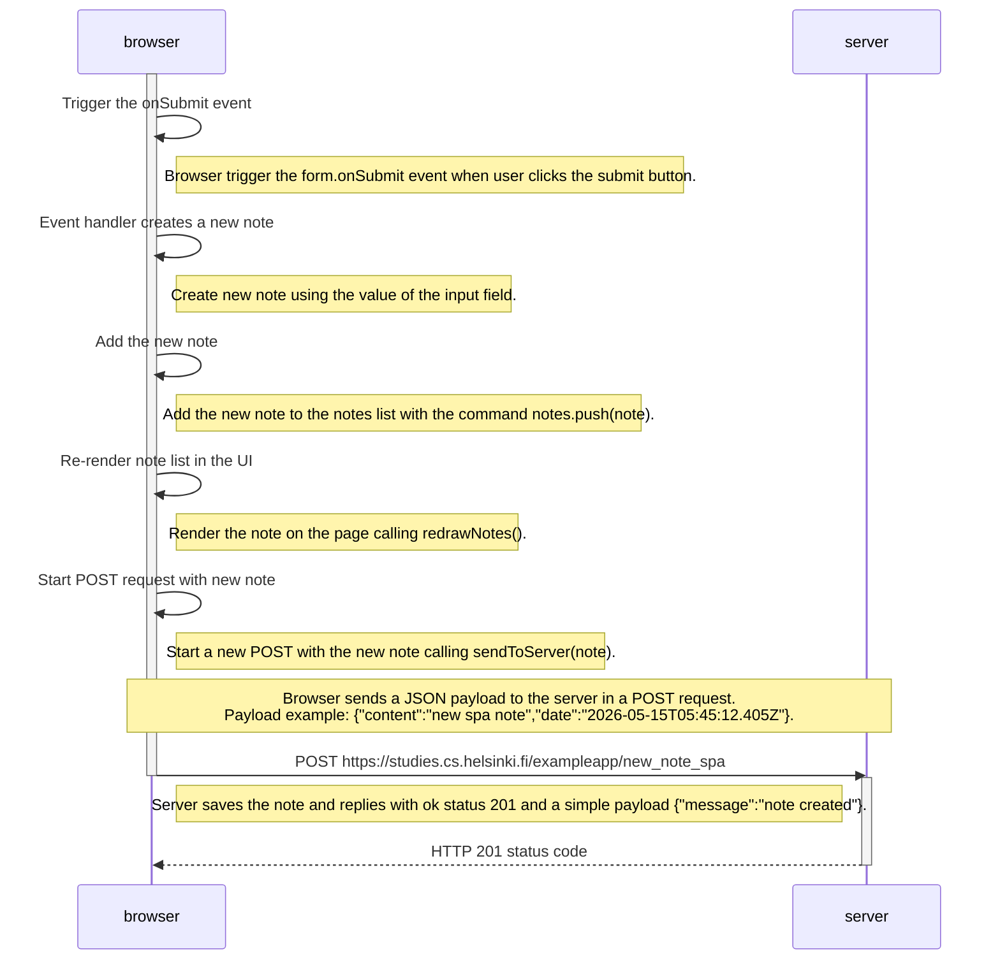

```mermaid
sequenceDiagram
    participant browser
    participant server

    activate browser
    browser->>browser: Trigger the onSubmit event
    Note right of browser: Browser trigger the form.onSubmit event when user clicks the submit button.

    browser->>browser: Event handler creates a new note
    Note right of browser: Create new note using the value of the input field.

    browser->>browser: Add the new note
    Note right of browser: Add the new note to the notes list with the command notes.push(note).

    browser->>browser: Re-render note list in the UI
    Note right of browser: Render the note on the page calling redrawNotes().

    browser->>browser: Start POST request with new note
    Note right of browser: Start a new POST with the new note calling sendToServer(note).

    Note over browser,server: Browser sends a JSON payload to the server in a POST request.<br/>Payload example: {"content":"new spa note","date":"2026-05-15T05:45:12.405Z"}.
    browser->>server: POST https://studies.cs.helsinki.fi/exampleapp/new_note_spa
    deactivate browser
    activate server
    Note left of server: Server saves the note and replies with ok status 201 and a simple payload {"message":"note created"}.
    server-->>browser: HTTP 201 status code
    deactivate server

```
